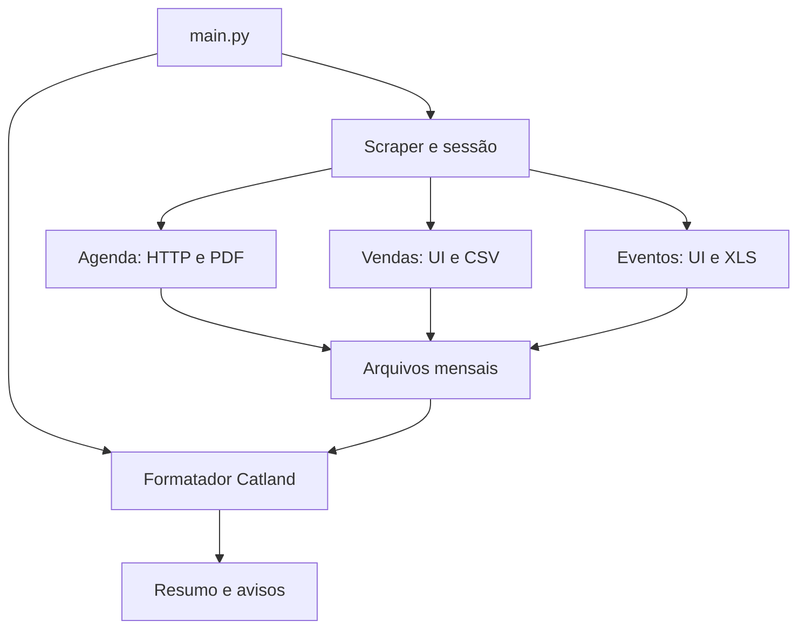

# 2. Arquitetura e fluxos

## Visão do todo

Pense no sistema como uma pequena linha de produção: um coordenador escolhe o mês, coletores trazem os arquivos, um conversor organiza a agenda e um analista monta o resumo. A separação existe, mas a troca entre etapas depende fortemente de nomes de arquivos.

| Componente | Responsabilidade e dependência |
|---|---|
| main.py | Executa o scraper; se recebe True, formata todos os meses; aguarda Enter e define código de saída. |
| scraper.py / SimplesVetScraper | Configuração, validação, navegador, login, sequência mensal e fechamento. |
| config.py / Config | JSON, credenciais, meses e primeiro/último dia do mês. |
| simplesvet_actions.py | Fachada: login, estado is_logged_in e delegação aos três extratores. |
| webdriver_manager.py | Chrome/Firefox, espera por seletores, navegação, pasta de download e fechamento. |
| appointment_extractor.py | Requisição autenticada do PDF da agenda; conversão; metadados da extração. |
| pdf_converter.py | Tabelas e texto do PDF → sete campos → XLSX. |
| venda_extractor.py | Tela de vendas → período → exportação CSV → seleção/conversão de colunas → XLSX. |
| procedure_extractor.py | Tela de atendimentos → evento 5 e 7 → exportação XLS/XLSX → nomes mensais. |
| data_formatter.py | Leitura dos arquivos, categorias de castrações, comparação de totais e resumo Catland. |
| vaccine_test_processor.py | Contagens por usuário/tipo, classificação pelo valor das vendas e soma de Líquido. |
| logger.py | Console e arquivo diário com rotação; instância criada ao importar. |

`src/scraper/__init__.py` também importa componentes; a versão declarada 1.0.0 é um literal do pacote, não certificação de estabilidade. Selenium, webdriver-manager e requests atendem coleta; pdfplumber atende PDF; pandas, openpyxl e xlrd atendem dados/exportação. PyPDF2 não é utilizado nas fontes examinadas; numpy não tem import direto, embora faça parte do ecossistema pandas.

## Fluxo 1 — inicialização e autenticação

1. main cria SimplesVetScraper e chama run.
2. Config lê `config/config.json` relativo à raiz do código.
3. Valida credenciais não vazias/não padrão e lista de meses YYYYMM; calcula intervalo mensal.
4. Instancia SimplesVetActions e os extratores; abre Chrome ou Firefox.
5. Navega à URL configurada, procura email/senha/botão por listas de seletores e preenche.
6. Considera login aceito se URL não contém “login”, ou encontra um seletor genérico de sucesso, ou o título não contém “login”.
7. Grava is_logged_in=True em memória. Não confirma empresa/unidade, identidade ou permissão e não revalida por mês.

Evidências: [src/scraper/scraper.py:14–100](https://github.com/adaserpa/scraper-simplesvet/blob/563e4ae84ccd1d60ddf166ad93a08041a4f637c9/src/scraper/scraper.py#L14-L100); [src/scraper/simplesvet_actions.py:76–209](https://github.com/adaserpa/scraper-simplesvet/blob/563e4ae84ccd1d60ddf166ad93a08041a4f637c9/src/scraper/simplesvet_actions.py#L76-L209). Falhas de configuração, navegador ou login retornam False. O fechamento fica em finally. Validação de credenciais aqui não é teste da senha no servidor.

## Fluxo 2 — agenda por mês

1. Converte YYYY-MM-DD para DD/MM/YYYY.
2. Monta GET do relatório com tipo=lista e data=início-fim.
3. Copia cookies do navegador para requests.Session e envia User-Agent e Referer.
4. Se status final é 200, grava PDF com nome mensal, removendo certos PDFs “doc*”.
5. pdfplumber extrai tabelas e texto; associa veterinário, reconhece cabeçalhos ou assume seis posições.
6. Descarta linhas julgadas observações ou sem data válida; exige cliente ou animal.
7. Gera XLSX e conta suas linhas.
8. Retorna lista de metadados; pode retornar pdf_only quando a conversão falha.

Evidências: [src/scraper/appointment_extractor.py:20–142](https://github.com/adaserpa/scraper-simplesvet/blob/563e4ae84ccd1d60ddf166ad93a08041a4f637c9/src/scraper/appointment_extractor.py#L20-L142); [src/scraper/pdf_converter.py:77–283](https://github.com/adaserpa/scraper-simplesvet/blob/563e4ae84ccd1d60ddf166ad93a08041a4f637c9/src/scraper/pdf_converter.py#L77-L283). Não há navegação/paginação da listagem da agenda neste fluxo: pede um relatório do período. Isso não prova que o relatório cobre todas as páginas ou não tenha limite.

## Fluxo 3 — vendas

1. Abre venda.php; clica no filtro de data e “Selecionar período”.
2. Move calendários esquerdo/direito até mês/ano alvo, com nomes dos meses em português.
3. Seleciona dia por texto; abre relatório; clica exportação rel=xls_vendas.
4. Depois de esperas fixas, procura o CSV mais recente na pasta.
5. Lê separador ;, tenta UTF-8 e depois Latin-1.
6. Mantém as colunas disponíveis entre 14 esperadas; converte números brasileiros; salva YYYYMM-vendas.xlsx.
7. Remove arquivo de origem se o nome exato for Vendas.csv.

Evidência: [src/scraper/venda_extractor.py:19–196](https://github.com/adaserpa/scraper-simplesvet/blob/563e4ae84ccd1d60ddf166ad93a08041a4f637c9/src/scraper/venda_extractor.py#L19-L196). Erro no período é apenas aviso: a exportação pode seguir com outro filtro. Nenhum endpoint de exportação é explicitamente reconstruído no código.

## Fluxo 4 — vacinas e exames

Executa o mesmo fluxo duas vezes: valor 5 para Vacina; 7 para Exames. Seleciona evento em p__tev_int_codigo, período no calendário, botão de relatório e exportação rel=xls. Limpa arquivos antigos “atendimento”, espera novo/modificado XLS/XLSX e renomeia mantendo extensão. O retorno é um dicionário com caminhos, inclusive None.

Evidência: [src/scraper/procedure_extractor.py:19–336](https://github.com/adaserpa/scraper-simplesvet/blob/563e4ae84ccd1d60ddf166ad93a08041a4f637c9/src/scraper/procedure_extractor.py#L19-L336). Há limite de 24 movimentos de calendário, mas não se exige confirmação de mês ou retorno True da seleção do dia antes de exportar.

## Fluxo 5 — resumo e validação

Ao terminar todos os meses, fecha navegador. Se run retorna True, main lê novamente a configuração e chama format_data para cada mês.

CatlandFormatter exige agenda/vendas em XLSX; renomeia Produto/serviço para procedimento; conta linhas por padrões de seis modalidades de castração e quatro categorias sexo/idade; compara total de vendas correspondentes com agendas “Atendido”. A comparação só de totais não identifica quais animais estão divergentes.

VaccineTestProcessor exige arquivos vacina.xls e exames.xls. Reconstrói cabeçalhos após skiprows=2, normaliza algumas grafias de colunas, filtra dois usuários fixos e tipos de vacina/teste. Se qualquer venda de mesmo nome de animal tem Líquido>0, considera externo; caso contrário interno. INTERNAL_CLIENTS está declarado, mas não participa dessa decisão.

O relatório YYYYMM-formatado.xlsx apresenta Item/Valor, contagens e soma de valores de vendas identificadas por palavras. Falhas no processamento de vacinas podem deixar valores padrão zero no resumo, pois a formatação continua.

Evidências: [src/formatter/data_formatter.py:214–343](https://github.com/adaserpa/scraper-simplesvet/blob/563e4ae84ccd1d60ddf166ad93a08041a4f637c9/src/formatter/data_formatter.py#L214-L343); [src/formatter/data_formatter.py:593–642](https://github.com/adaserpa/scraper-simplesvet/blob/563e4ae84ccd1d60ddf166ad93a08041a4f637c9/src/formatter/data_formatter.py#L593-L642); [src/formatter/vaccine_test_processor.py:54–191](https://github.com/adaserpa/scraper-simplesvet/blob/563e4ae84ccd1d60ddf166ad93a08041a4f637c9/src/formatter/vaccine_test_processor.py#L54-L191).

## Funções auxiliares e lacunas

navigate_to_appointments, set_date_filter e espera de PDF no disco não fazem parte do fluxo principal atual; set_date_filter só retorna True. Não existe fila persistente, checkpoint, política geral de retries, paralelismo, captura HAR ou paginação explícita de registros. A extração é mensal e sequencial; nomes fixos permitem sobrescrita, não uma retomada verificada.

