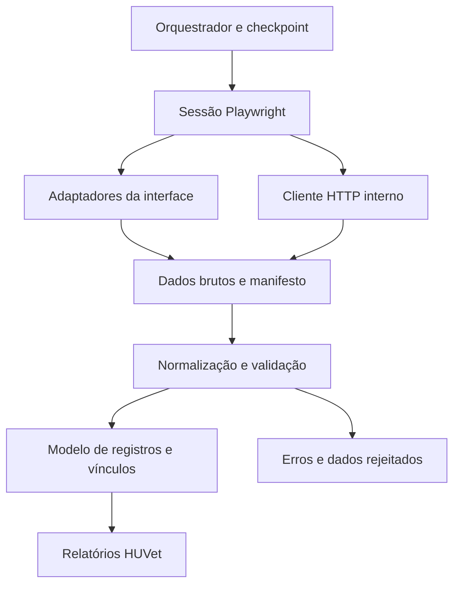

# 5. Reaproveitamento e proposta Playwright

Este capítulo é uma proposta derivada do estudo, não uma implementação aprovada ou funcional. A escolha Python/TypeScript permanece aberta; os exemplos documentais usam Python por proximidade do original.

## Matriz de decisão

| Elemento | Decisão sugerida | Razão |
|---|---|---|
| Separação configuração/coleta/transformação/resumo | Reaproveitar ideia | Facilita entender e testar cada parte. |
| Meses → intervalos | Adaptar | Útil como unidade de trabalho; incluir tipo de dado e execução. |
| Navegador para login + HTTP para coleta | Reaproveitar ideia central | Já demonstrada como intenção concreta no código da agenda. |
| Selenium/WebDriverManager | Substituir por Playwright | Nova sessão/contexto, locators, downloads e requisições integradas. |
| Cópia manual de cookies | Substituir inicialmente por context.request | Usa cookies do mesmo BrowserContext; headers/tokens ainda precisam ser descobertos. |
| sleep após cliques | Substituir por condições verificáveis | Esperar interação possível, resposta, filtro confirmado ou download. |
| “Arquivo mais recente” | Substituir por download vinculado à ação | Evita confundir execução antiga ou concorrente. |
| PDF como origem primária | Manter como alternativa | Primeiro verificar dados estruturados; PDF é útil para comparação ou quando só ele existe. |
| Relatório/exportação estruturada | Adaptar | Pode ser caminho inicial mais simples que reconstruir todas as APIs. |
| Heurísticas Catland | Separar/substituir | Regras HUVet precisam ser explícitas e configuráveis. |
| Classificação por nome do animal | Substituir | Usar ID de animal/tutor/serviço/evento quando disponíveis. |
| Venda positiva = pago | Substituir | Distinguir cobrança, venda, execução clínica e recebimento. |
| Booleano de sucesso global | Substituir | Resultado por operação com estados e evidências. |
| Logs | Adaptar | Incluir execução, etapa, duração, contagens; evitar dados pessoais e sessão. |
| Nomes mensais com sobrescrita | Adaptar | Pasta por execução e manifesto; publicação do resultado só após validar. |

## Arquitetura candidata

Sessão: valida identidade/contexto de empresa, autentica e detecta expiração. Adaptadores UI: sabem quais controles usar, sem regras de indicadores. Cliente HTTP: conhece contratos confirmados, parâmetros e validações. Normalização: preserva dado bruto, produz estrutura uniforme e registra rejeições. Regras HUVet: operam sobre registros identificados, independentemente do caminho de coleta.

O Playwright oferece context.request/page.request com cookies compartilhados com o navegador, conforme [APIRequestContext](https://playwright.dev/python/docs/api/class-apirequestcontext). Isso não copia automaticamente tokens de localStorage para um header Authorization e não dispensa descobrir CSRF, headers e empresa ativa. Uma chamada via page.evaluate/fetch é outra opção quando depende do contexto JavaScript; também exige contrato e tratamento explícitos. Não é necessário escolher um mecanismo universal agora.

Para exportações da interface, [expect_download](https://playwright.dev/python/docs/downloads) deve envolver a ação que inicia o download e save_as persistir o arquivo antes de fechar o contexto. Para cliques/preenchimento, [auto-waiting](https://playwright.dev/python/docs/actionability) ajuda com visibilidade e possibilidade de interação; ainda precisamos conferir que o filtro aplicado e o resultado pertencem ao intervalo solicitado.

[Estado autenticado](https://playwright.dev/python/docs/auth) pode ser reutilizado se a aplicação permitir; deve ficar fora do repositório. Sessão expirada precisa virar estado reconhecido, não arquivo HTML com nome PDF.

## Contratos mínimos propostos

Resultado de operação: run_id, operação, período, origem, estado, horário, tentativas, arquivos, hashes, quantidade esperada/extraída quando conhecida, registros rejeitados e erro. Estados distintos: sucesso_validado, vazio_validado, falha, parcial e pendente. Ausência de arquivo não significa automaticamente período vazio.

Registro: preservar source_id/source_type, identificador de animal/tutor, data original e normalizada, unidade/empresa quando disponível e vínculo com evidência bruta. Não fabricar IDs do SimplesVet quando a fonte não os contém; marcar identidade incompleta e limitar reconciliação.

Checkpoint: concluir a unidade apenas depois de validar a saída. Repetir uma coleta deve gerar resultado rastreável e evitar duplicação; uma eventual escrita no SimplesVet precisa ter sua própria estratégia de idempotência. A fase atual estuda coleta, não implementa escrita.

## Escolha do caminho por operação

1. Confirmar o objetivo e os campos necessários.
2. Observar a chamada real produzida pela aplicação para aquela ação.
3. Se houver resposta estruturada com IDs e cobertura verificável, avaliar cliente HTTP.
4. Se exportação nativa satisfizer o objetivo, comparar custo/robustez com endpoint estruturado.
5. Usar UI onde o contrato direto ainda não esteja confirmado ou dependa do fluxo.
6. Usar PDF como fallback ou evidência de comparação, com perdas explícitas.

Não há endpoints novos descobertos neste estudo além das rotas registradas na fonte. As URLs de listagem não revelam por si sós seus endpoints de busca/exportação.

## Fase prática futura sugerida

| Experimento | Evidência necessária | Critério de conclusão |
|---|---|---|
| Sessão/login | Tela e resposta autenticada; empresa ativa | Confirmar identidade e detectar sessão expirada. |
| Agenda GET | Request/response sanitizados e PDF exemplo | Validar período, formato e completude; comparar UI. |
| Vendas exportação | Chamada de exportação, headers e CSV | Identificar contrato e itens/IDs; comparar contagens/valores. |
| Eventos 5/7 | Select atual e resposta/exportação | Confirmar códigos, formato, IDs e relação com animal. |
| Fonte estruturada | Respostas observadas e paginação | Preservar todos os campos necessários e concluir todas as páginas. |
| Parser isolado | Amostras sintéticas/sanitizadas | Detectar homônimos, quantidade >1, cancelamento e arquivo incompleto. |
| Orquestração | Falhas simuladas e repetição | Nunca anunciar sucesso de etapa falha; retomar sem dados antigos. |

A próxima validação pode começar pela agenda porque já há contrato explícito na fonte. Isso ainda exige confirmar necessidade HUVet e comportamento atual; não é autorização automática para todas as interações ou alterações em dados.

